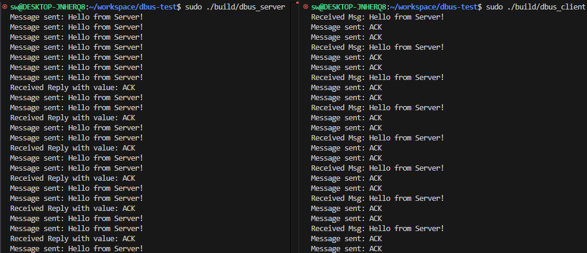
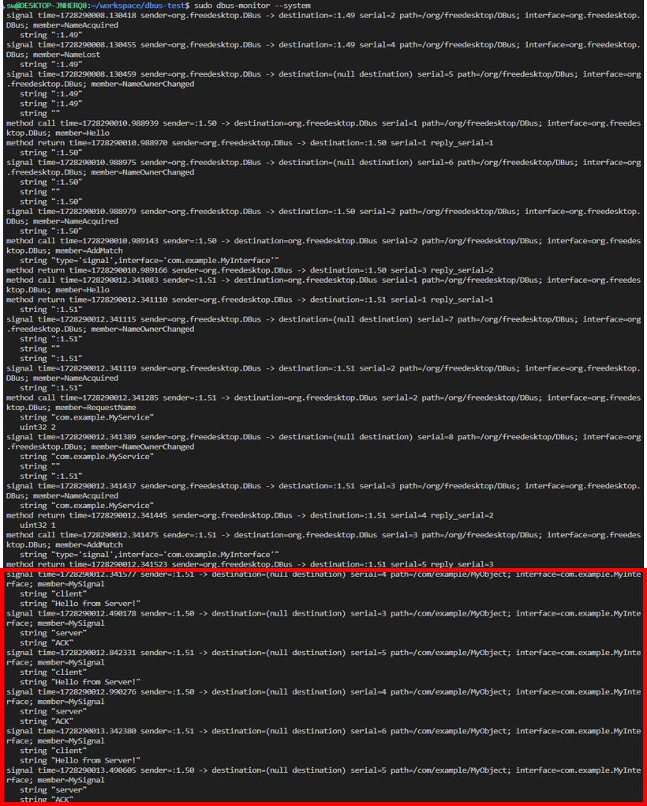

# DBus Simple communication demo
## Introduction
This project demonstrates a simple client-server communication using D-Bus. The project includes two main components: `dbus_server` and `dbus_client`, which communicate with each other via D-Bus.


## Setup Dbus
### Install DBus
```
sudo apt-get install dbus
```

Note: the D-Bus system bus socket is missing or the D-Bus service is not running.
- Enable Service
    ```sh
    sudo systemctl start dbus
    sudo systemctl enable dbus
    ```
- Check State of Service
    ```sh
    sudo systemctl status dbus
    ls -l /var/run/dbus/system_bus_socket
    ```

## Compilier Project 
### Build with scripts
```sh
./runner.sh 
```

### Build with command
```sh
cmake -S . -B build
cmake --build build
```

## Run Demo
```sh
sudo killall -9 dbus_server dbus_client
```
- Terminal 1
```sh
sudo ./build/dbus_server
```
- Terminal 2
```sh
sudo ./build/dbus_client
```
- Terminal 3
```sh
sudo dbus-monitor --system
```

## Execute Result

